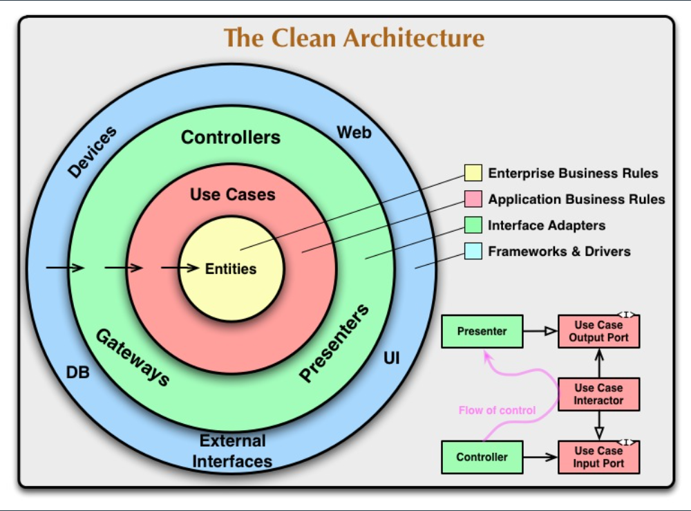

# Node.js + TypeScript Clean Architecture — Har File Ka Kaam



        

Is project mein 4 main layers hain:

```txt
presentation  -> request / response
application   -> business logic
domain        -> rules / interfaces
infrastructure-> database aur external libraries
```

---

# 1. server.ts

```ts
import dotenv from 'dotenv';
import app from './src/app';
import connectDatabase from './src/infrastructure/config/database';
```

## Kaam

Ye project ka entry point hai.

Flow:

```txt
1. .env load karta hai
2. MongoDB connect karta hai
3. Express server start karta hai
```

Agar `server.ts` na ho to app run hi nahi karegi.

---

# 2. src/app.ts

```ts
app.use(cors());
app.use(express.json());
```

## Kaam

Ye main express app banata hai.

### `cors()`

Frontend ko backend access karne deta hai.

Example:

```txt
Frontend: localhost:3000
Backend : localhost:5000
```

Without CORS browser request block kar dega.

### `express.json()`

JSON body ko read karta hai.

Example:

```json
{
  "email": "test@gmail.com"
}
```

Iske bina `req.body` undefined hota hai.

### Routes Mount

```ts
app.use('/auth', authRoutes);
```

Matlab:

```txt
/auth/signup
/auth/login
```

---

# 3. domain/entities/User.ts

```ts
export interface User {
  id?: string;
  username: string;
  email: string;
  password: string;
}
```

## Kaam

Ye user ka shape define karta hai.

Matlab har user object aise hona chahiye:

```ts
{
  username: string,
  email: string,
  password: string
}
```

Ye sirf structure batata hai, database code nahi.

---

# 4. domain/repositories/UserRepository.ts

```ts
export interface UserRepository {
  findByEmail(email: string): Promise<User | null>;
}
```

## Kaam

Ye contract hai.

Ye bolta hai:

```txt
Jo bhi repository hogi usme ye methods hone chahiye:
- findByEmail
- findById
- create
```

Isse application layer ko farq nahi padta ke tum MongoDB use kar rahe ho ya MySQL.

---

# 5. domain/errors/

## UserAlreadyExistsError.ts

Signup ke time agar same email already mil jaye to ye error throw hoti hai.

```txt
User already exists
```

## InvalidCredentialsError.ts

Login ke time agar password ya email wrong ho.

```txt
Invalid email or password
```

Custom errors ka faida:

```txt
Readable code
Easy debugging
```

---

# 6. application/dto/

DTO = Data Transfer Object

## SignUpDTO.ts

```ts
{
  username,
  email,
  password
}
```

## LoginDTO.ts

```ts
{
  email,
  password
}
```

## Kaam

Ye define karta hai ke use case ko kis format mein data milega.

---

# 7. application/services/PasswordService.ts

```ts
hash(password)
compare(password, hashed)
```

## Kaam

Ye bhi interface hai.

Application layer ko pata nahi hota ke bcrypt use ho raha hai ya koi aur library.

Sirf ye pata hota hai:

```txt
Mujhe password hash karna hai
Mujhe password compare karna hai
```

---

# 8. application/services/TokenService.ts

```ts
generate(userId)
verify(token)
```

## Kaam

Ye JWT ke liye interface hai.

Application layer kehti hai:

```txt
Mujhe token banana aur verify karna hai
```

Lekin actual JWT code infrastructure mein hai.

---

# 9. application/use-cases/SignUpUser.usecase.ts

Ye signup ki asli business logic hai.

Flow:

```txt
1. Email already exist check karo
2. Password hash karo
3. User save karo
4. User return karo
```

Example:

```ts
const existingUser = await this.userRepository.findByEmail(data.email);
```

Agar user mil jaye:

```ts
throw new UserAlreadyExistsError();
```

---

# 10. application/use-cases/LoginUser.usecase.ts

Ye login ki business logic hai.

Flow:

```txt
1. Email se user find karo
2. Password compare karo
3. JWT token banao
4. Token + user return karo
```

Example:

```ts
const token = this.tokenService.generate(user.id!);
```

---

# 11. application/use-cases/GetProfile.usecase.ts

Ye profile route ki business logic hai.

Flow:

```txt
1. userId lo
2. Database se user nikaalo
3. User return karo
```

---

# 12. infrastructure/config/database.ts

```ts
mongoose.connect(process.env.MONGO_URI)
```

## Kaam

MongoDB connect karta hai.

`.env` se MONGO_URI leta hai.

---

# 13. infrastructure/database/models/UserModel.ts

Ye actual MongoDB schema hai.

```ts
const userSchema = new Schema({
  username: String,
  email: String,
  password: String
})
```

## Kaam

MongoDB ko batata hai ke user collection mein kaun kaun se fields hongi.

Ye directly database ke saath baat karta hai.

---

# 14. infrastructure/repositories/MongoUserRepository.ts

Ye `UserRepository` interface ki implementation hai.

Matlab domain ne bola tha:

```txt
findByEmail
findById
create
```

Aur yahan actual MongoDB code likha gaya:

```ts
await UserModel.findOne({ email })
```

Ye database aur application ke beech bridge hai.

---

# 15. infrastructure/services/BcryptPasswordService.ts

Ye `PasswordService` ka actual version hai.

```ts
bcrypt.hash()
bcrypt.compare()
```

## Kaam

Plain password ko secure password mein convert karta hai.

Example:

```txt
123456
↓
$2a$10$....
```

---

# 16. infrastructure/services/JwtTokenService.ts

Ye `TokenService` ka actual version hai.

```ts
jwt.sign()
jwt.verify()
```

## Kaam

Login ke baad token generate karta hai.

Example:

```txt
Bearer eyJhbGciOiJIUzI1Ni...
```

---

# 17. shared/types/ExpressRequest.ts

Express ke normal Request mein `user` property nahi hoti.

Isliye custom request banayi:

```ts
req.user.userId
```

Ye auth middleware ke baad available hota hai.

---

# 18. presentation/validators/signup.validator.ts

```ts
if (!username || !email || !password)
```

## Kaam

Request validate karta hai.

Example:

```txt
Password empty ho
Ya 6 se chhota ho
```

To error dega.

---

# 19. presentation/validators/login.validator.ts

Login request validate karta hai.

```txt
Email aur password hona chahiye
```

---

# 20. presentation/controllers/auth.controller.ts

Controller ka kaam hota hai:

```txt
1. Request receive karo
2. Validator call karo
3. Use case call karo
4. Response bhejo
```

Example:

```ts
const { username, email, password } = req.body;
```

Phir:

```ts
const useCase = new SignUpUserUseCase(...)
```

Controller mein business logic nahi honi chahiye.

Galat:

```ts
if (password.length < 6) {}
```

Ye validator mein hona chahiye.

---

# 21. presentation/controllers/profile.controller.ts

Ye authenticated user ka profile return karta hai.

```ts
req.user!.userId
```

Ye value middleware se aati hai.

---

# 22. presentation/middlewares/auth.middleware.ts

Ye protected routes ke liye hota hai.

Flow:

```txt
1. Authorization header lo
2. Token nikalo
3. Token verify karo
4. req.user mein userId save karo
5. next()
```

Example request:

```txt
Authorization: Bearer token_here
```

Agar token wrong ho:

```txt
401 Invalid token
```

---

# 23. presentation/routes/auth.routes.ts

```ts
router.post('/signup', signup)
router.post('/login', login)
```

## Kaam

Ye URL ko controller ke saath connect karta hai.

---

# 24. presentation/routes/profile.routes.ts

```ts
router.get('/', authMiddleware, getProfile)
```

## Kaam

Pehle middleware chalega.

Agar token valid ho tab `getProfile` chalega.

---

# 25. .env

```env
PORT=5000
MONGO_URI=mongodb://127.0.0.1:27017/clean-auth
JWT_SECRET=supersecret
```

## Kaam

Secret values yahan rakhi jati hain.

Example:

```txt
Database URL
JWT secret
Port
```

Inhe code mein directly nahi likhna chahiye.

---

# Complete Request Flow

## Signup

```txt
POST /auth/signup
↓
auth.routes.ts
↓
auth.controller.ts
↓
signup.validator.ts
↓
SignUpUser.usecase.ts
↓
MongoUserRepository
↓
UserModel
↓
MongoDB
```

---

## Login

```txt
POST /auth/login
↓
auth.routes.ts
↓
auth.controller.ts
↓
login.validator.ts
↓
LoginUser.usecase.ts
↓
MongoUserRepository
↓
BcryptPasswordService
↓
JwtTokenService
↓
Response with Token
```

---

## Profile

```txt
GET /profile
↓
profile.routes.ts
↓
auth.middleware.ts
↓
profile.controller.ts
↓
GetProfile.usecase.ts
↓
MongoUserRepository
↓
Response
```
